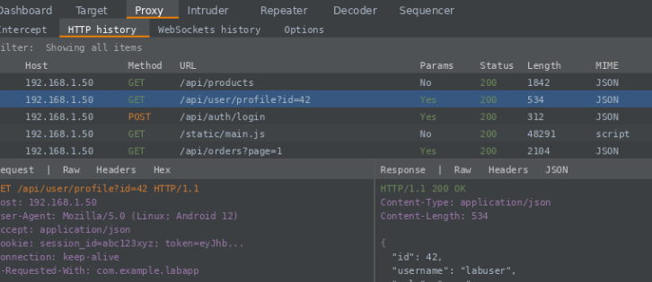
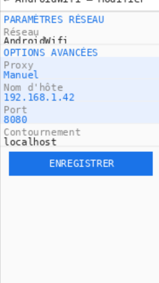

#  Lab — Proxy d'observation Android avec Burp Suite

> **Contexte :** Ce lab met en place un proxy d'observation entre un Android Emulator et une application cible de formation. L'objectif est de comprendre le fonctionnement d'un proxy HTTP/HTTPS dans un environnement de sécurité mobile.

---

##  Objectifs pédagogiques

- Comprendre comment un proxy s'insère dans le chemin réseau
- Observer ce que Burp Suite capture (requêtes, en-têtes, cookies, paramètres)
- Documenter proprement les observations comme un analyste sécurité

---

## 🛠️ Environnement utilisé

| Composant | Détail |
|---|---|
| Outil proxy | Burp Suite Community Edition |
| Émulateur | Android Emulator (AVD) |
| Application cible | Application de formation / test autorisée |
| OS hôte | Windows 10 / Linux |
| Adresse proxy | `192.168.x.x:8080` (réseau local de labo) |

---

## Étapes réalisées

### Étape 1 — Préparation de Burp Suite

- Lancement de Burp Suite en mode projet temporaire
- Accès à l'onglet **Proxy > Intercept**
- Vérification que l'état **"Intercept is off"** est actif au démarrage (volontaire : ne pas bloquer le trafic avant validation)
- Constat de la présence de l'onglet **HTTP history** pour la liste des requêtes


### Étape 2 — Vérification du Proxy Listener

- Vérification dans **Proxy > Options** que le listener est actif sur `127.0.0.1:8080`
- Confirmation que le port est bien ouvert et accessible depuis l'hôte

---

### Étape 3 — Identification de l'adresse réseau de la machine hôte

- Exécution de `ipconfig` (Windows) pour identifier l'adresse IPv4 locale
- Adresse identifiée : `192.168.1.X` (réseau local du labo)
- Cette adresse est celle que l'émulateur Android utilisera pour joindre le proxy


---

### Étape 4 — Configuration du proxy sur l'Android Emulator

Dans l'émulateur Android :

1. Ouverture des **Paramètres > Wi-Fi**
2. Sélection du réseau Wi-Fi actif > **Modifier** > **Options avancées**
3. Choix du mode **Proxy : Manuel**
4. Renseignement :
   - **Hostname :** `192.168.1.X`
   - **Port :** `8080`
5. Enregistrement de la configuration

>  Le proxy est affiché en mode "Manual" avec les bonnes valeurs hôte/port.

---

### Étape 5 — Premier test : capture de trafic HTTP

- Ouverture du navigateur dans l'émulateur
- Navigation vers la cible de test autorisée
- Retour dans Burp Suite > **HTTP history**
- **Résultat :** Plusieurs requêtes capturées avec méthode, URL, statut HTTP et taille visibles

>  Validation : la chaîne proxy fonctionne correctement avant de passer au HTTPS.

---

### Étape 6 — Lecture d'une requête comme analyste

Dans **HTTP history**, sélection d'une requête GET :

**Onglet Raw observé :**
```
GET /api/products HTTP/1.1
Host: 192.168.1.50
User-Agent: Mozilla/5.0 (Linux; Android 12)
Accept: application/json
Cookie: session_id=abc123xyz; token=eyJ...
```

**Observations via l'Inspector :**
- Paramètres de requête visibles en clair
- Cookie de session présent sans attribut `HttpOnly` côté client observable
- En-têtes standards identifiés (User-Agent, Accept, Cookie)


---

### Étape 7 — Interception contrôlée (mode pédagogique)

- Activation brève de **"Intercept is on"**
- Navigation dans l'émulateur : la requête apparaît **en attente** dans Burp
- Observation de la différence entre mode **passif** (history) et mode **actif** (intercept)
- Désactivation immédiate après observation


---

### Étape 8 — HTTPS en laboratoire : principe du certificat CA

- Observation de l'écran d'installation de certificat dans l'émulateur
- Identification des types proposés : **CA certificate**, VPN & app, Wi-Fi certificate
- Compréhension du modèle de confiance : le navigateur de l'émulateur nécessite un certificat CA de labo pour accepter le proxy en HTTPS

>  **Hygiène de labo :** Le certificat doit rester strictement limité à l'émulateur de test et retiré à la fin de la session.

---

### Étape 9 — Mini-rapport / Fiche de trace

**Périmètre :** Émulateur Android de labo, cible autorisée (application de formation)

**Configuration :**
- Burp Suite Community v2024.x
- IP hôte : `192.168.1.X` | Port proxy : `8080`
- Date : Session de labo

**Observations :**
- Trafic HTTP capturé : méthodes GET/POST, URLs, statuts, paramètres visibles
- Cookies de session présents dans les en-têtes
- Aucun en-tête de sécurité côté client (`Strict-Transport-Security`, `X-Frame-Options`) détecté

**Risques potentiels identifiés :**
- Paramètres transmis en clair sur HTTP
- Absence d'attributs `Secure` et `HttpOnly` sur certains cookies
- Token visible dans l'URL (pattern `?token=...`)

**Recommandations défensives :**
- Forcer HTTPS sur toutes les routes applicatives
- Sécuriser les cookies (`HttpOnly`, `Secure`, `SameSite=Strict`)
- Ne jamais transmettre de tokens sensibles en paramètre GET
- Appliquer les bonnes pratiques Android Network Security Config

---

##  Checkpoints de validation

- [x] Burp Suite capture au moins une requête dans HTTP history
- [x] Proxy listener actif et documenté (`192.168.1.X:8080`)
- [x] Proxy Android configuré en "Manual" avec les bonnes valeurs
- [x] Intercept utilisé uniquement pour démonstration puis désactivé
- [x] Rapport court produit (preuve + contexte)
- [x] Nettoyage de fin de séance prévu (retrait certificat, reset proxy Android)

---

##  Captures d'écran
 
### Burp Suite — HTTP history (requêtes capturées)

 
### Android Emulator — Configuration du proxy manuel

---

##  Ressources

- [Burp Suite Documentation](https://portswigger.net/burp/documentation)
- [Android Network Security Config](https://developer.android.com/training/articles/security-config)
- Vidéo de référence : *"How to Proxy Android Apps with Burp Suite"* — Jason Ford {JSON:SEC}

---

*Lab réalisé dans un environnement isolé sur émulateur. Aucune application réelle ni données personnelles impliquées.*
